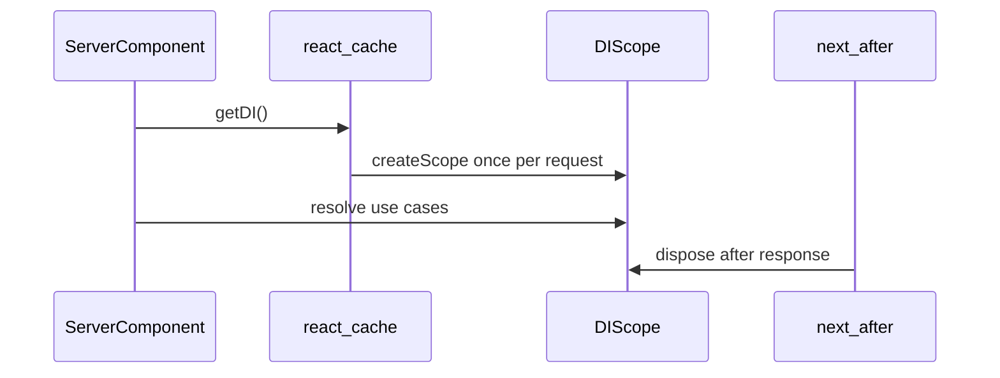

# Next.js Server Components and DI

Japanese: [SERVER_COMPONENTS.ja.md](./SERVER_COMPONENTS.ja.md)

This guide explains how to use `createServerDI` from `@wyrly/next` in the **App Router** without
storing request scopes globally.

## Requirements

- **Next.js 15+** App Router
- **React 19** (`cache()` from `react`)
- `after()` from `next/server` (used to dispose the scope after the response)

Route Handlers and Server Actions use different helpers; see the comparison table below.

## Request model

One HTTP request must map to **one DI scope** for scoped and transient providers.

`createServerDI` implements that as follows:



- `cache()` ensures every `getDI()` call in the same request returns the **same** scope.
- `after()` schedules `scope.dispose()` when the response finishes (including streaming edge cases
  Next handles).

Implementation reference: [`packages/next/server_di.ts`](../packages/next/server_di.ts).

## Setup

### 1. Composition root

Register providers on a root `Container` as usual (singleton app services, scoped request services).

### 2. Server DI factory (once per app)

```ts
// src/composition/server_di.ts
import { appContainer } from "./container.ts";
import { createServerDI } from "@wyrly/next";

export const { getDI } = createServerDI(appContainer);
```

In production, `after` defaults to Next’s `after()`. For unit tests or non-Next runners, inject a
mock:

```ts
export const { getDI } = createServerDI(appContainer, {
  after(fn) {
    queueMicrotask(() => void fn());
  },
});
```

See
[`examples/next-ddd/presentation/server_component.ts`](../examples/next-ddd/presentation/server_component.ts).

### 3. Use in a Server Component

```tsx
// app/users/[id]/page.tsx
import { getDI } from "@/composition/server_di";
import { GetUserUseCase } from "@/application/get_user";

export default async function UserPage({ params }: { params: Promise<{ id: string }> }) {
  const { id } = await params;
  const di = getDI();
  const usecase = di.resolve(GetUserUseCase);
  const user = await usecase.execute(id);
  return <pre>{JSON.stringify(user)}</pre>;
}
```

Call `getDI()` only from code that runs **inside the request** (Page, Layout, or functions they call
synchronously in that tree). Do not call it from module top-level or from a background job.

### 4. Request-specific values

Set port tokens at the start of the request (middleware, layout, or page):

```ts
const di = getDI();
di.set(CurrentUserToken, { id: userId });
```

Avoid injecting `NextRequestToken` into domain or application layers. Map framework data to **port
tokens** in the presentation or composition layer.

## API comparison (`@wyrly/next`)

| Surface                      | Use in                             | Scope lifecycle                                            |
| ---------------------------- | ---------------------------------- | ---------------------------------------------------------- |
| `withDI`                     | Route Handlers (`route.ts`)        | Created per handler; disposed in `finally`                 |
| `withActionDI`               | Server Actions                     | Created per action invocation; disposed in `finally`       |
| `createServerDI` → `getDI()` | Server Components (Pages, Layouts) | One scope per request via `cache()`; disposed in `after()` |

## Testing

- Mock `after` so disposal runs deterministically (microtask or immediate).
- Each `createServerDI(container)` factory is independent; two factories do not share scopes.
- Reuse the same factory (`getDI`) within a test simulating one request.

Tests: [`packages/next/server_di_test.ts`](../packages/next/server_di_test.ts).

## Anti-patterns

| Do not                                                             | Why                                                                  |
| ------------------------------------------------------------------ | -------------------------------------------------------------------- |
| Store `Scope` in a global variable                                 | Breaks request isolation; race conditions across requests            |
| Call `getDI()` outside the request tree                            | `cache()` is tied to the current React request context               |
| Share one `getDI` factory across unrelated tests without resetting | Scopes may leak between tests                                        |
| Inject `NextRequest` into use cases                                | Couples domain to Next.js; use port tokens                           |
| Assume Edge Runtime behavior without testing                       | `after()` / `cache()` availability depends on Next deployment target |

## Stability note

Server Components depend on Next.js and React request semantics. The **shape** of `createServerDI` /
`getDI()` is stable in v1.0; underlying Next APIs may evolve. Pin Next.js versions in production and
re-run adapter tests when upgrading Next.

## See also

- [examples/next-ddd](../examples/next-ddd/) — Route Handler, Server Action, and Server Component in
  one DDD layout
- [API.md — `@wyrly/next`](../API.md#wyrlynext)
- [README.md — Next.js Route Handler](../README.md#nextjs-route-handler-example)
